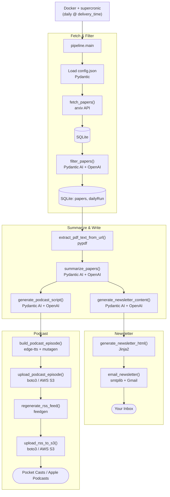

# Doomscrolling Antidote

A daily research digest pipeline. Give it the arXiv categories and keywords
you care about, and every day it will:

1. Fetch the latest papers from arXiv in your chosen categories.
2. Filter them down to the most relevant ones for your learning goals, using
   an LLM.
3. Summarize each paper and explain why it's relevant to you.
4. Generate and email you a newsletter with the day's picks.
5. Generate an AI-narrated podcast episode covering the same papers, upload
   it to S3, and publish it as an RSS feed you can subscribe to from
   Pocket Casts, Apple Podcasts, or any other podcast app.

The goal is to replace mindless scrolling with a focused, daily habit of
reading and listening to research in the fields you actually want to learn.

This is a single-tenant, self-hosted — designed for one user running it on their own machine via Docker. User preferences are saved in a config.json file.

## How It Works



**Tech stack:**

| Layer | Technology |
|---|---|
| Paper source | [arxiv](https://pypi.org/project/arxiv/) (arXiv API client) |
| Data validation / models | [Pydantic](https://docs.pydantic.dev/) |
| LLM orchestration | [Pydantic AI](https://ai.pydantic.dev/) + OpenAI (`gpt-5-nano`) |
| PDF parsing | [pypdf](https://pypi.org/project/pypdf/) |
| Storage | SQLite |
| Newsletter templating | [Jinja2](https://jinja.palletsprojects.com/) |
| Email delivery | `smtplib` + Gmail (app password) |
| Text-to-speech | [edge-tts](https://pypi.org/project/edge-tts/) |
| Audio tagging | [mutagen](https://mutagen.readthedocs.io/) |
| Podcast hosting | [boto3](https://boto3.amazonaws.com/) + AWS S3 |
| RSS feed generation | [feedgen](https://feedgen.kiesow.be/) |
| Scheduling / deployment | Docker + [supercronic](https://github.com/aptible/supercronic) |

## Requirements

- Python 3.12+ (or Docker)
- An OpenAI API key
- A Gmail account with an [app password](https://myaccount.google.com/apppasswords) (used to send the newsletter)
- An AWS account with an S3 bucket (used to host the podcast audio and RSS feed)

## Setup

### 1. Install dependencies

```bash
pip install -r requirements.txt
```

### 2. Create `config.json`

Create a `config.json` file in the project root:

```json
{
  "arxiv_categories": [
    "cs.AI",
    "..."
  ],
  "keywords": [
    "..."
  ],
  "email": "<your email>",
  "delivery_time": "07:00",
  "timezone": "America/Toronto",
  "papers_per_digest": 6,
  "max_papers_fetched_per_category": 30,
  "llm_model": "gpt-5-nano",
  "llm_provider": "openai",
  "user_intention": "...",
  "tone": "..."
}
```

| Field | Description |
|---|---|
| `arxiv_categories` | arXiv category codes to pull papers from (e.g. `cs.AI`, `cs.AR`) |
| `keywords` | Keywords used to filter papers for relevance |
| `email` | Your email address |
| `delivery_time` | Time of day the digest should be generated (`HH:MM`) |
| `timezone` | Timezone for `delivery_time`, e.g. `America/Toronto` |
| `papers_per_digest` | Max number of papers included in each day's digest |
| `max_papers_fetched_per_category` | Max papers fetched per category before filtering |
| `llm_model` | Model used for filtering, summarizing, and writing content |
| `llm_provider` | LLM provider (currently `openai`) |
| `user_intention` | What you're trying to learn or achieve — guides paper selection and summaries |
| `tone` | Tone/style used for the newsletter and podcast script |

### 3. Create `.env`

Create a `.env` file in the project root with:

```
OPENAI_API_KEY=
SENDER_EMAIL=
RECEIVER_EMAIL=
APP_PASSWORD=
BUCKET_NAME=
```

| Key | Description |
|---|---|
| `OPENAI_API_KEY` | Your OpenAI API key |
| `SENDER_EMAIL` | Gmail address the newsletter is sent from |
| `RECEIVER_EMAIL` | Address the newsletter is sent to |
| `APP_PASSWORD` | Gmail [app password](https://myaccount.google.com/apppasswords) for `SENDER_EMAIL` (not your regular Gmail password) |
| `BUCKET_NAME` | Name of the S3 bucket used to host podcast audio and the RSS feed |

### 4. Configure AWS credentials

Create `.aws/config`:

```
[default]
region=<your aws region>
```

Create `.aws/credentials`:

```
[default]
aws_access_key_id=<your aws access key id>
aws_secret_access_key=<your aws secret access key>
```

The AWS credentials need permission to create/manage the S3 bucket set in
`BUCKET_NAME` (the pipeline will create the bucket and make it public-read
if it doesn't already exist).

## Running

### Locally

```bash
python -m pipeline.main
```

### With Docker

```bash
docker compose up --build
```

This builds the image, installs dependencies, and runs the pipeline daily
at 7:00 AM (`America/Toronto` by default — adjust `TZ` in the `Dockerfile`
to your timezone) via cron inside the container.

## Listening to your podcast

Once the pipeline has run at least once, it publishes an RSS feed to your S3
bucket at:

```
https://<BUCKET_NAME>.s3.<region>.amazonaws.com/rss/feed.xml
```

Add that URL to Pocket Casts, Apple Podcasts, or any podcast app that
supports subscribing via a custom RSS URL, and new episodes will show up
automatically each day.

## Tests

```bash
pytest tests/
```

The test suite checks connectivity to arXiv, your OpenAI key, and your S3
bucket, plus validates your `config.json` and `.env` are populated
correctly. Some tests hit live services and require valid credentials to
pass.

## Contributing

Contributions are welcome!

1. Fork the repo and create a branch off `main` for your change. Create a feature/<your brannch name> branch.
2. Set up your own `config.json`, `.env`, and AWS credentials as described
   above so you can run the pipeline locally.
3. Make your changes, keeping functions small and consistent with the
   existing style (see `pipeline/` and `llm/agents.py`).
4. Run the test suite (`pytest tests/`) and confirm nothing regresses.
5. Open a pull request with a clear description of what changed and why.

For bugs or feature ideas, please open an issue first so it can be discussed
before you invest time in a PR.
